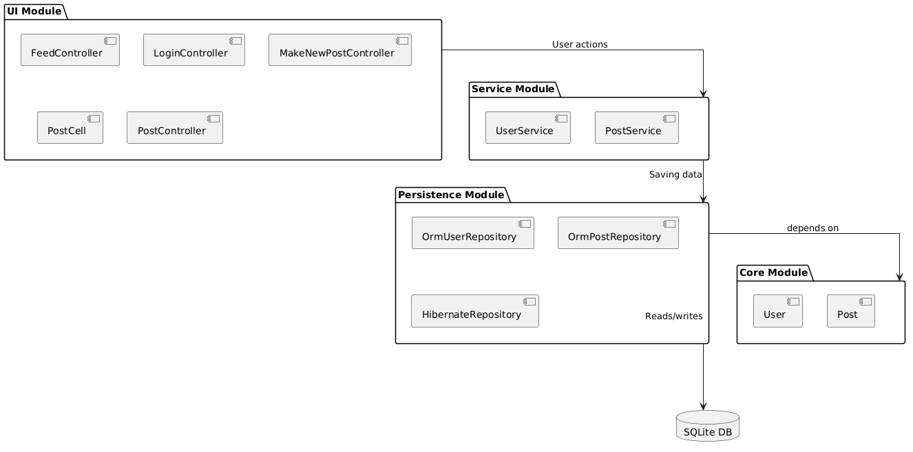
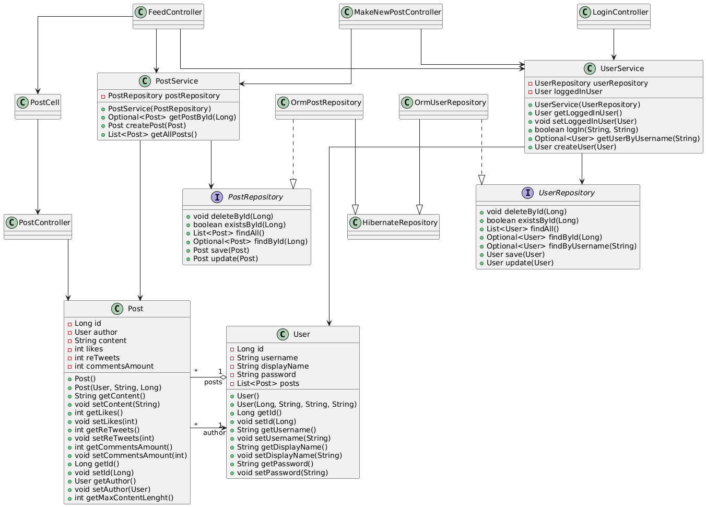

# IT1901 Group 8: Twitter Clone

Welcome to group 8's Informatics Project I GitHub repository!

[Open repository in Eclipse Che](https://che.stud.ntnu.no/#https://git.ntnu.no/IT1901-2025-groups/gr2508?new)

> [!NOTE]
> To use Eclipse Che with a private repository such as this one:
>
> - Generate a [personal access token (PAT)](https://git.ntnu.no/settings/tokens) on GitHub. Make sure it has repo read/write access.
> - Provide this PAT to Eclipse Che in your [User Preferences](https://che.stud.ntnu.no/dashboard/#/user-preferences?tab=PersonalAccessTokens)
>
> Otherwise, Eclipse Che won't have access to this repository and the instance you open will be empty.

## Project Dependencies

We assume you have installed:

- Java 17 or above
- The latest version of Maven 3.9.x

All other dependencies are described in the different `pom.xml` files and shall be installed automatically by Maven.

## Getting Started

### Module installation

Make sure you have installed the required dependencies listed above.

The commands listed below assume your current working directory is `twitter-clone`.
To change your working directory, run `cd twitter-clone` when you are in the project root.

First, you must install all the modules. You will need to skip all tests, because the tests require a REST API running the background.

Use the following command:

```sh
mvn install -DskipTests -Dcheckstyle.skip -Dspotbugs.skip -Djacoco.skip -T 1C
```

<details>

<summary>Using PowerShell?</summary>

Then you'll need to wrap the parameters in quotation marks:

```sh
mvn install "-DskipTests" "-Dcheckstyle.skip" "-Dspotbugs.skip" "-Djacoco.skip" -T 1C
```

</details>

### REST API setup

The API depends on a secret key to generate authentication tokens, and this secret is not commited to version control.

Generate the `jwtSecret` for the API module:

Copy the file `api/src/main/resources/application.properties.example` to `api/src/main/resources/application.properties`.

The example file contains placeholder secrets.

Run the following command (from `twitter-clone`):

```sh
mvn -q -pl api exec:java -Dexec.mainClass="api.utils.JwtKeyGenerator"
```

Override the example secret with the generated value.

### Running the app

> [!NOTE]
> The client requires the REST API to be running on `localhost:8080`

Start the api:

```sh
cd api 
mvn spring-boot:run
```

Start the client:

```sh
cd ui
mvn javafx:run
```

### Testing the app

Start the api if you're running ui integration tests:

```sh
cd api
mvn spring-boot:run
```

Run the tests:

```sh
mvn test
```

The tests can also be run in your favorite IDE. We have tested that everything works in VS Code.

If you would like to see the JaCoCo code coverage and spotbugs reports, use the following command:

```sh
mvn verify
```

You can read the SpotBugs report by opening `twitter-clone/<module>/target/site/spotbugs.html` and you can read the JaCoCo report by opening `twitter-clone/<module>/target/site/jacoco/index.html`.
The `<module>` must be replaced with the module name, without the angle brackets.

## Other Documentation

### Release 1

- [Release 1 docs](./docs/release1/README.md)
- [Project description](./docs/release1/project-description.md)
- [Usage of AI tools](./docs/release1/ai-tools.md)

### Release 2

- [Release 2 docs](./docs/release2/README.md)
- [Usage of AI tools](./docs/release2/ai-tools.md)
- [Code quality](./docs/release2/code-quality.md)
- [Persistence](./docs/release2/persistence.md)
- [Teamwork](./docs/release2/teamwork.md)
- [Work-practicies](./docs/release2/work-practicies.md)
- [Workflow](./docs/release2/workflow.md)

- [Package diagram](./docs/release2/package-diagram.puml)
- [Class diagram](./docs/release2/class-diagram.puml)

| Package diagram | Class diagram |
|---------------|----------------|
|  |  |
