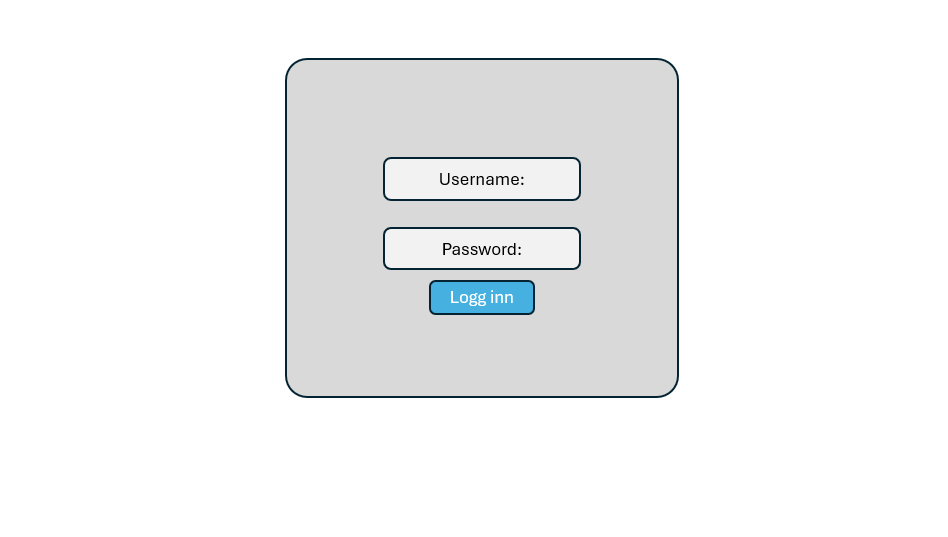
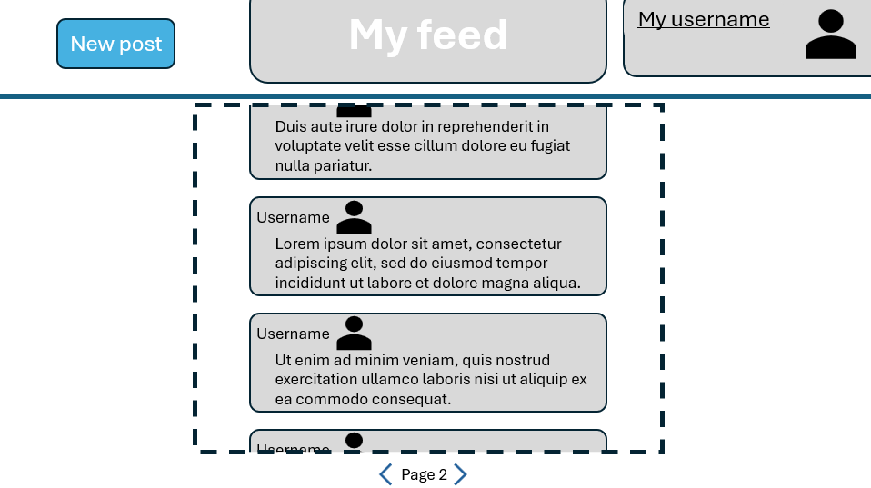
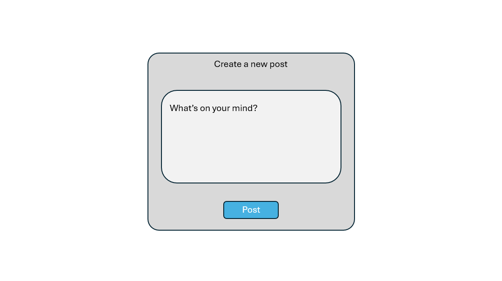
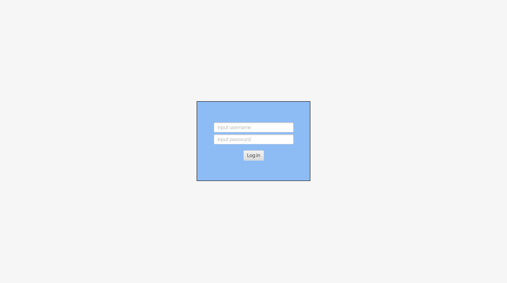
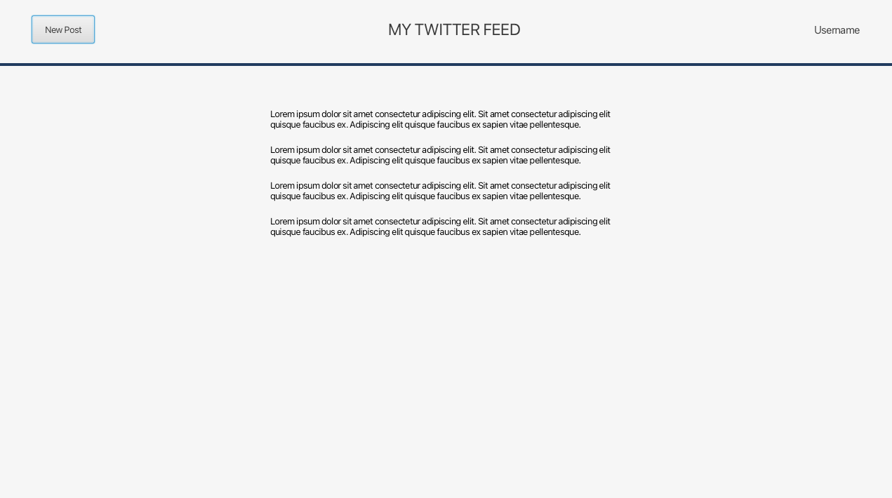
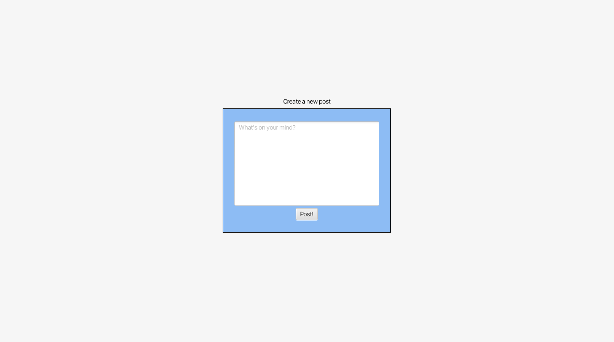

# Twitter Clone: Project Description

> [!WARNING]
> This file is outdated.
> Read the updated project description in the [project description markdown file for release 3](../release3/project-description.md).

We want to create an application inspired by Twitter, which today is known as X. Throughout this project, we will refer to the base application as **Twitter**, not X.

Twitter Clone is a simple social media application that allows users to publish and read short messages.
All posts are displayed in a shared feed, giving users an easy way to stay updated on what other Twitter Clone users are sharing.
The application supports interaction through likes and retweets, allowing users to engage with one another.

The user experience focuses on short and concise communication, and the app functions as a tool for sharing information, opinions, and news. Twitter is well known for its influence on both news and public debate, and we aim to capture some of that dynamic in our application.

### UI Mockups

### User Stories (Release 1)

1. As a user I want to have an account to log in to, so that I can access my personal feed.
2. As a user I want to navigate to and view a list (feed) of posts.

### Application Views (Release 1)

